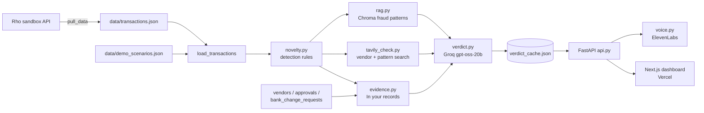

# TrustLedger: Project Context

**Vendor payment fraud monitoring for startups, with evidence you can check.**
Built on Rho's transaction API for the LOCK IN Hack (Rho, Sep 12-13 2026).

| | |
|---|---|
| Live app | https://trust-ledger-ai.vercel.app |
| Backend API | https://yogananda16-trustledger.hf.space |
| Repository | https://github.com/Yogananda16/Trust_Ledger |

---

## 1. The problem

Startups pay vendors with almost no automated checks. Companies usually vet a vendor once, when it's added, but most payment fraud gets past that one-time check:

- **Business email compromise (BEC)** cost US businesses **$3.05B in 2025**, about **$123k per complaint**, and **86%** of it went out by wire or ACH (FBI IC3 2025).
- **76%** of US organisations faced attempted or actual payment fraud in 2025; **74%** were hit by BEC. Only **17%** use AI to fight it (AFP 2026 Payments Fraud and Control Survey).
- Fraud runs a median **12 months** before detection. Caught within 6 months, the median loss is **$40k**; after 5+ years it's **$1.1M**. More than half of cases involve missing or overridden internal controls (ACFE Occupational Fraud 2026).
- Since **June 22, 2026**, Nacha rules require every business that originates ACH payments to run risk-based monitoring for payments "authorized under false pretenses", which explicitly covers BEC, vendor impersonation and payroll impersonation.

Enterprise tools exist for large procurement teams. A lean startup with just a bank account has nothing.

## 2. What TrustLedger does

TrustLedger reads a company's Rho transactions and, for every outgoing vendor payment:

1. **Flags** it with detection rules (new vendor, bank change, duplicate invoice, look-alike name, payment burst, insider patterns and more).
2. **Explains** it with facts from the company's own records ("In your records").
3. **Checks the web** with Tavily: the vendor itself (company profile or scam and enforcement records) and public reporting on the matching fraud pattern.
4. **Rates** it Low, Medium or High with an LLM verdict that cites the evidence.
5. **Speaks** the alert as a voice briefing (ElevenLabs).
6. **Teaches** the five fraud patterns on a Fraud playbook page, linked to where each appears in the data.

## 3. How onboarding checks get beaten (the five patterns)

| Pattern | How it works | Why a one-time vendor check misses it | Real case |
|---|---|---|---|
| **Vendor bank details changed** | A real vendor's email is hacked or spoofed; a "we changed banks" message redirects payments | The vendor is real and already approved | Toyota Boshoku, $37M (2019) |
| **Look-alike vendor** | A company or domain with almost the same name as a real supplier sends invoices | A registry search finds a real company | Facebook and Google, $122M, fake "Quanta Computer" (2013-2015) |
| **Boss pressure and payment bursts** | An urgent, confidential "CEO/CFO" request, sometimes with a deepfake call; several large payments go out fast | No new vendor to check, only pressure | Arup, $25M in 15 transfers (2024) |
| **Fake, duplicate or inflated invoice** | Invoices for work never done, reused invoice numbers, or unsolicited listing/renewal bills | The vendor may look fine | FTC actions against fake directory and trademark invoice schemes |
| **Insider paying themselves** | An employee pays a shell company, keeping each payment under the second-approval limit | The insider controls the process | ACFE: controls missing or overridden in over half of cases |

## 4. Architecture



| Layer | Technology | Hosted on |
|---|---|---|
| Frontend | Next.js 16, React 19, Tailwind CSS 4, TypeScript | Vercel |
| API | FastAPI + Uvicorn (Python 3.10) | Hugging Face Space (Docker, CPU Basic) |
| LLM | Groq, `openai/gpt-oss-20b` | Groq API |
| Web search | Tavily | Tavily API |
| Fraud-pattern retrieval | Chroma + sentence-transformers `all-MiniLM-L6-v2` | Inside the API container |
| Voice | ElevenLabs `eleven_multilingual_v2`, voice "Sarah" | ElevenLabs API |
| Data source | Rho sandbox API | Rho |

## 5. Detection rules (`pipeline/novelty.py`)

Outgoing payment types analysed: `ach_debit`, `wire_out`, `international_wire_out`, `check_payment`. Card swipes are employee purchases, not vendor invoicing, so they're excluded.

| Signal | Rule | Pattern | Shown as chip |
|---|---|---|---|
| First payment | No earlier payment to this vendor and amount ≥ $500 | none | yes |
| Unusual amount | Over 2× this vendor's average and ≥ $500 | fake_invoice | yes |
| Bank details changed | Payee account differs from the account on earlier payments | bank_change | yes |
| Look-alike name | ≥ 85% name similarity to a vendor already paid | lookalike | yes |
| Duplicate invoice | Same invoice number already used by a different payee | fake_invoice | yes |
| Listing or renewal invoice | Memo mentions renewal, listing, directory, trademark or domain | fake_invoice | yes |
| Large wire | Wire of $10,000 or more | none | yes |
| Vague memo | Memo empty or generic ("Vendor payment", "Transfer to external account") and ≥ $500 | none | yes |
| Awaiting approval | Status `awaiting_approval` and ≥ $500 | none | yes |
| Just under the limit | 2+ payments between 90% and 100% of the $5,000 approval limit | insider | yes |
| Payee shares employee's name | Payee contains an employee's surname | insider | yes |
| Pressure language | Memo contains urgent, confidential, ASAP, immediately, wire today, per CEO/CFO | exec_pressure | no (used for evidence and pattern) |
| Payment burst | 2+ first-time payees paid within 60 minutes | exec_pressure | no (used for evidence and pattern) |

Each signal carries a `context` object (for example the old and new account, or the original invoice's transaction ID) that the evidence builder uses. The latest flagged payment per vendor is what the dashboard shows.

## 6. Evidence and verdict

### 6.1 In your records (`pipeline/evidence.py`)
Plain-English facts built from the company's own data, for example:
- "3 earlier payments to Northwind Freight Co. went to account ••4417."
- "The sender's domain northwind-freight.example doesn't match northwindfreight.example, the domain on file for this vendor."
- "Invoice 317 was paid to Summit Legal LLP on Mar 15, 2026: $562.50, settled."
- "Priya Shah created this payment and approved it 1 minute later, without the required second approval."

Sources: `transactions.json`, `vendors.json` (vendor list: email domain, bank account, who added it and when), `bank_change_requests.json` and `approvals.json`.

### 6.2 Vendor web search (`pipeline/tavily_check.py`)
Two modes, both returning at most 3 links and keeping only pages that contain the vendor's exact name (legal suffixes like Inc. or LLC are ignored when matching):

| Mode | When | Query style | Ordering |
|---|---|---|---|
| **Verification** | Default | `"<name>" company headquarters founded official website` | As returned |
| **Scam-record search** | Vendor has a listing or renewal invoice signal | `"<name>" scam fraud FTC lawsuit complaint warning` | .gov sources first, then trusted outlets |

Fictional scenario vendors skip the name search, so unrelated real companies with similar names are never linked to fraud.

### 6.3 Pattern web evidence ("On the web")
For the vendor's main fraud pattern, Tavily searches public reporting once per pattern and caches it in `data/web_evidence_cache.json`. Results are limited to trusted domains (FBI, IC3, FTC, CISA, DOJ, SEC, Nacha, ACFE, AFP, BBB and major news outlets), must contain pattern keywords, and are de-duplicated.

### 6.4 Fraud-pattern retrieval (`pipeline/rag.py`)
18 fraud patterns (`data/fraud_patterns.json`, drawn from FTC and FBI guidance) are embedded in a local Chroma store. The 3 closest matches to each flagged payment are passed to the LLM and shown as "Matched fraud patterns".

### 6.5 LLM verdict (`pipeline/verdict.py`)
Groq `openai/gpt-oss-20b` receives the signals, memo, record evidence, matched patterns and vendor web findings, and returns:
```
RISK: <Low, Medium, or High>
REASON: <one sentence citing specific evidence>
```
Tier guidance:
- **High:** corroborated red flags: scam or enforcement records, no findable business, recently registered domain, a name mimicking an established company, duplicate invoice number, changed bank details, a look-alike of a vendor already paid, pressure plus a burst of new payees, or repeated just-under-limit payments to a payee sharing an employee's name.
- **Medium:** plausible but unverified vendor, a large first payment over $5,000, or a large wire with a vague memo.
- **Low:** established, findable business with no concerning signals, or a small downside.

The LLM is told to use only web findings about the exact vendor and to prefer record evidence.

**Rate-limit handling** (Groq free tier: 8,000 tokens per minute):
- `reasoning_effort: "low"` and `max_completion_tokens: 400`.
- One Groq call at a time across all requests.
- Pacing from Groq's `x-ratelimit-remaining-tokens` and reset headers.
- Retries on 429 for up to 3 minutes.
- If a verdict still fails, the vendor shows a signal-based stand-in rating and the web results are kept for the retry.

### 6.6 Voice briefing (`pipeline/voice.py`)
`GET /api/briefing/{vendor}` builds "Heads up about <vendor>. They were paid <amount>. This is flagged <risk> risk. <reason>" and returns an MP3 from ElevenLabs (voice ID `EXAVITQu4vr4xnSDxMaL`, "Sarah").

### 6.7 Caching
- `data/verdict_cache.json`: one entry per vendor with risk, reason, matched patterns, web sources, the exact prompt detail and a `search_version`. A verdict is regenerated only when the detail changes; the web search reruns only when `SEARCH_VERSION` in `api.py` is bumped.
- `data/web_evidence_cache.json`: pattern search results.
- Both caches ship with the deployment, so the live API answers instantly without calling Groq or Tavily.

## 7. Data

### 7.1 Rho sandbox data
`data/transactions.json` and `data/accounts.json`, pulled from `https://rhoapi-sandbox.rho.co/api/v1` by `pipeline/pull_data copy.py` (paginated `accounts` and `transactions` endpoints).

Real findings in this data:
- **Everline Creative Studio:** Invoice 317 ($562.50) paid to Summit Legal LLP, then sent again 2 days later to a different payee by wire.
- **Civic Affairs Inc.:** a $59,000 wire with the memo "Transfer to external account", created 2 minutes before a $12,500 first payment to Harborline Logistics.
- **Harborline Logistics:** $12,500 first payment still awaiting approval.
- **Wellstone Media LLC:** first payment with the vague memo "Vendor payment".

### 7.2 Scenario data (supplementary)
`data/demo_scenarios.json` adds payments modelled on documented fraud patterns, plus the records behind them. They load by default (`DEMO_SCENARIOS=0` hides them) and aren't labelled in the UI. Names and `.example` email domains are fictional, except the pinned verification vendors below, which are real companies chosen because their public records are the point.

| Pin | Vendor | Scenario | Expected result |
|---|---|---|---|
| 1 | Trademark Compliance Center | $1,885 "Trademark registration renewal" check, awaiting approval | **High**: Tavily finds the USPTO bulletin on fraudulent trademark solicitations and reports that its operators admitted the scam |
| 2 | Premium Business Pages | $1,450 "Annual business directory listing renewal" | **High**: Tavily finds three ftc.gov pages, including the FTC case against Premium Business Pages Inc. (Operation Main Street) |
| 3 | Amazon Web Services | $2,180.37 cloud hosting | Verified real business (BBB profile, PitchBook) |
| 4 | Deel | $3,600 contractor payments | **Low**: verified real business (Wikipedia, Contrary Research) |
| 5 | Gusto | $1,240 payroll subscription | **Low**: verified real business (Wikipedia, GlobalData) |
| none | Northwind Freight Co. | 3 payments to ••4417, then a 4th to ••9921 after an emailed bank-change request from a mismatched domain, no call-back | High, bank_change |
| none | Summit Legal LLC | $8,750 invoice from a near-copy of Summit Legal LLP, different domain and account, added 22 hours before paying | High, lookalike |
| none | Halcyon Advisory Partners, Brightpath Capital Ltd, Meridian Escrow Services | $150,000 in 3 "confidential acquisition, per CFO" wires within 40 minutes, each vendor added minutes before, self-approved without the required second approval | High, exec_pressure |
| none | R. Collins Consulting | 3 × $4,950 payments, just under the $5,000 limit, vendor added, paid and approved by employee Andrew Collins | High, insider |

The `pin` field orders vendors at the top of the dashboard.

### 7.3 Data files

| File | Contents |
|---|---|
| `transactions.json`, `accounts.json` | Rho sandbox data |
| `demo_scenarios.json` | Scenario and pinned payments |
| `vendors.json` | Vendor list: email domain, bank account, added by, added at |
| `bank_change_requests.json` | Bank change requests: sender, old and new account, call-back verified |
| `approvals.json` | Approver, approval time, whether a second approval was required |
| `playbook.json` | The 5 patterns: description, real case, sourced fact, search query, keywords |
| `fraud_patterns.json` | 18 fraud patterns for retrieval |
| `verdict_cache.json`, `web_evidence_cache.json` | Caches (see 6.7) |
| `eval_set.csv` | Labelled vendors for `eval.py` |

## 8. Dashboard (`frontend/app/page.tsx`)

**Sidebar:** Vendors · Fraud playbook.

**Vendors page:**
- Summary cards: Transactions, Flagged, At risk (sum of Medium and High flagged amounts).
- Search box and risk filters (All, High, Medium, Low).
- Vendor list ordered by pin, then risk, then amount. Each row shows the memo, amount, signal chips, a ▶ voice briefing button (Medium and High) and the risk badge.
- Expanded panel:
  - **Why this was flagged:** the LLM reason.
  - **In your records:** record evidence.
  - **On the web:** up to 3 pattern articles from trusted sources.
  - **Matched fraud patterns:** retrieval results.
  - **Sources checked:** up to 3 Tavily results about the vendor.

**Fraud playbook page:** one card per pattern with how it works, a real case, a sourced fact and a **"Found in your data: N →"** button that filters the Vendors list to matching vendors.

The backend address comes from `NEXT_PUBLIC_API_URL` (default `http://localhost:8000`). If the API can't be reached, the page says so.

## 9. API (`api.py`)

| Endpoint | Returns |
|---|---|
| `GET /` | `{"status": "ok", "service": "TrustLedger API"}`, the health check |
| `GET /api/vendors` | Totals, `demo_count` and every vendor with signals, evidence, web evidence, risk, reason, matched patterns, sources and pin |
| `GET /api/playbook` | The 5 patterns with `matches` (vendor names found in the data) |
| `GET /api/briefing/{vendor}` | MP3 voice briefing for a flagged vendor |
| `GET /api/eval` | Stored evaluation metrics |

CORS allows `http://localhost:3000`, `https://trust-ledger-ai.vercel.app` (override with `ALLOWED_ORIGINS`) and any `https://trust-ledger*.vercel.app` preview URL.

## 10. Repository layout

```
Trust_Ledger/
├── api.py                  FastAPI app: vendors, playbook, briefing, health
├── warm_cache.py           Pre-computes all verdicts into the cache
├── deploy_space.py         Uploads the backend to the Hugging Face Space
├── eval.py                 Precision/recall/F1 against data/eval_set.csv
├── app.py                  Earlier Streamlit prototype UI
├── Dockerfile              Backend image for Hugging Face Spaces
├── requirements.txt        Backend Python dependencies
├── pipeline/
│   ├── novelty.py          Detection rules and signals
│   ├── evidence.py         "In your records" sentences
│   ├── tavily_check.py     Vendor verification, scam-record and pattern searches
│   ├── rag.py              Chroma fraud-pattern retrieval
│   ├── verdict.py          Groq LLM verdict with rate-limit pacing
│   ├── voice.py            ElevenLabs voice briefings
│   ├── pull_data copy.py   Rho sandbox API ingestion
│   └── export_to_excel.py  Exports data to a spreadsheet
├── data/                   See section 7.3
└── frontend/               Next.js dashboard (deployed to Vercel)
    └── app/
        ├── page.tsx        Vendors and Fraud playbook views
        └── layout.tsx      Page title and fonts
```

## 11. Configuration

**Backend** (`.env` locally, Space secrets in production):

| Variable | Purpose |
|---|---|
| `GROQ_API_KEY` | LLM verdicts |
| `TAVILY_API_KEY` | Web searches |
| `ELEVENLABS_API_KEY` | Voice briefings |
| `RHO_API_TOKEN` | Rho sandbox ingestion (local only) |
| `DEMO_SCENARIOS` | `0` hides scenario data (default shown) |
| `ALLOWED_ORIGINS` | Comma-separated CORS origins (optional) |

**Frontend** (Vercel environment variable):

| Variable | Value |
|---|---|
| `NEXT_PUBLIC_API_URL` | `https://yogananda16-trustledger.hf.space` |

## 12. Running locally

```bash
python -m venv venv
venv\Scripts\activate
pip install -r requirements.txt
uvicorn api:app --reload --port 8000
```
In a second terminal:
```bash
cd frontend
npm install
npm run dev
```
Open http://localhost:3000. Without `NEXT_PUBLIC_API_URL`, the frontend uses `http://localhost:8000`.

To pull fresh Rho data: `python "pipeline/pull_data copy.py"`.

## 13. Deployment

**Backend (Hugging Face Space `yogananda16/trustledger`, Docker, CPU Basic, Protected):**
1. Space secrets: `GROQ_API_KEY`, `TAVILY_API_KEY`, `ELEVENLABS_API_KEY`.
2. Log in once: `hf auth login`.
3. Optional, to pre-fill verdicts: stop the local server, then run `python warm_cache.py`.
4. Upload: `python deploy_space.py yogananda16/trustledger`. It uploads only `Dockerfile`, `requirements.txt`, `api.py`, `warm_cache.py`, `pipeline/*.py` and `data/*.json`, never `.env`.
5. The Space rebuilds automatically (about 1-2 minutes). The image installs CPU-only PyTorch, pre-downloads the embedding model and serves Uvicorn on port 7860.

**Frontend (Vercel project `trust-ledger-ai`):**
1. Set `NEXT_PUBLIC_API_URL` for Production and Preview.
2. Push to `main`; Vercel builds `frontend/` automatically.

**Before a demo:** open the live site a few minutes early so the Space is awake.

## 14. Demo walkthrough

1. **Trademark Compliance Center (High):** expand it → "Sources checked" shows the USPTO warning found by Tavily → note "awaiting approval, can still be stopped" → play the ▶ briefing.
2. **Premium Business Pages (High):** three FTC pages, including the case naming the company.
3. **Deel and Gusto (Low):** the same search verifies legitimate vendors, so not everything new is treated as fraud.
4. **Northwind Freight Co.:** bank details changed after an email from a mismatched domain, with no call-back.
5. **Everline Creative Studio:** Invoice 317 reused, from the real Rho data.
6. **Fraud playbook:** open a pattern → "Found in your data" → filtered vendor list.

## 15. Judge Q&A

**"Wouldn't a company check a vendor before paying?"**
Yes, once, when the vendor is added. Most payment fraud rides on vendors and invoices that already passed that check: bank details change on a real vendor, invoices get reused, look-alike companies copy real suppliers, and insiders stay under approval limits. BEC still cost US businesses $3.05B in 2025. Since June 2026, Nacha requires businesses sending ACH to monitor for payments made under false pretenses. TrustLedger is that monitoring for a startup without a treasury team: it flags at approval time (payments still `awaiting_approval` can be stopped) and keeps watching after, because fraud caught within 6 months costs a median $40k versus $1.1M after five years.

**"Does it block payments?"**
Today it flags and explains. The next step is plugging into Rho's approval flow so a High-risk payment requires a second approver.

**"Where does the evidence come from?"**
Three places, each shown separately: the company's own records, Tavily searches about the exact vendor, and public reporting on the fraud pattern from trusted sources.

## 16. Known constraints and next steps

- **Bank details on real payments:** Rho transaction data doesn't include payee account numbers, so bank-change detection runs on the scenario records. Next step: use Rho payee account data.
- **Approval limit:** the $5,000 second-approval limit is an assumed company policy.
- **Generic names:** exact-name matching still finds different businesses that share the same words; the LLM is instructed to ignore them.
- **Snapshot of the data:** verdicts are cached; new transactions need a cache refresh (`warm_cache.py`) and redeploy.
- **Next:** approval-time blocking via Rho, live ingestion from the Rho API instead of static files, and payee bank-account verification.

## 17. Sources

| Fact | Source |
|---|---|
| BEC $3.05B in 2025, about $123k per complaint, 86% via wire or ACH | FBI IC3 2025 Annual Report: https://www.ic3.gov/AnnualReport/Reports/2025_IC3Report.pdf |
| 76% faced payment fraud, 74% BEC, 17% use AI | AFP 2026 Payments Fraud and Control Survey: https://www.financialprofessionals.org/about/learn-more/press-releases/Details/over-75-percent-of-us-firms-experienced-payments-fraud-in-2025-while-ai-adoption-for-fraud-mitigation-lags |
| 12-month median duration, $40k vs $1.1M, controls missing in over half of cases | ACFE Occupational Fraud 2026: https://www.acfe.com/acfe-insights-blog/blog-detail?s=key-findings-report-to-the-nations-2026 |
| Nacha false-pretenses fraud monitoring, Phase 2 effective June 22, 2026 | https://www.nacha.org/rules/risk-management-topics-fraud-monitoring-phase-2 |
| Verify bank-detail changes through a known contact | FBI IC3 BEC guidance: https://www.ic3.gov/CrimeInfo/BEC |
| Spoofed domain example (@co-pany.com), fake credit and W-9 tactics | FBI IC3 PSA 2023: https://www.ic3.gov/PSA/2023/PSA230324 |
| Toyota Boshoku $37M | https://www.bleepingcomputer.com/news/security/over-37-million-lost-by-toyota-boshoku-subsidiary-in-bec-scam/ |
| Facebook and Google $122M via fake Quanta invoices | https://www.cnbc.com/2019/03/27/phishing-email-scam-stole-100-million-from-facebook-and-google.html |
| Arup $25M deepfake video call | https://www.cnn.com/2024/05/16/tech/arup-deepfake-scam-loss-hong-kong-intl-hnk |
| FTC action against Premium Business Pages (Operation Main Street) | https://www.ftc.gov/legal-library/browse/cases-proceedings/182-3011-x180033-9140-9201-quebec-inc-premium-business-pages-inc |
| USPTO list of fraudulent trademark solicitations (Trademark Compliance Center) | https://www.uspto.gov/trademarks/protect/examples-fraudulent-misleading-solicitations |
