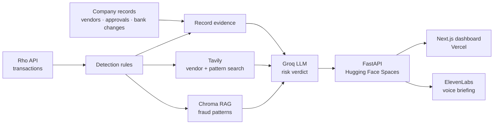

# TrustLedger

AI agent for startups and small businesses that detects suspicious vendors and payments before the money is sent. 
It verifies vendors using transaction history, scam patterns, and live web data, then explains exactly why a payment may be risky.

**Live app:** https://trust-ledger-ai.vercel.app

**Demo video:** https://drive.google.com/file/d/1-RvjdkhMDpnAsMLlM5gGc6xEaksXNlQ-/view

## The problem

Companies vet a vendor once, when it's added. Most payment fraud gets past that: changed bank details, reused invoices, look-alike vendors, pressured wires and insiders. Business email compromise alone cost US businesses $3.05B in 2025 (FBI IC3). Enterprise tools exist; a startup with just a bank account has nothing.

## How it works

1. **Detect:** rules flag new vendors, bank-detail changes, duplicate or look-alike invoices, payment bursts, just-under-limit payments and more.
2. **Explain:** facts from the company's own records ("In your records").
3. **Verify:** Tavily searches the exact vendor (company profile or scam and enforcement records) and public reporting on the fraud pattern.
4. **Rate:** an LLM combines the evidence and matched fraud patterns (RAG) into a Low, Medium or High verdict with a reason.
5. **Alert:** a spoken briefing via ElevenLabs.

## Architecture



## Tech stack

Next.js · FastAPI · Groq · Tavily · Chroma · ElevenLabs · Rho API. Frontend on Vercel, backend on Hugging Face Spaces.

## Project structure

```
Trust_Ledger/
├── api.py                  # FastAPI backend: vendors, playbook, voice briefing
├── Dockerfile              # Backend container (Hugging Face Spaces)
├── requirements.txt        # Python dependencies
├── deploy_space.py         # Deploys the backend to Hugging Face
├── warm_cache.py           # Pre-computes risk verdicts
├── pipeline/
│   ├── novelty.py          # Detection rules
│   ├── evidence.py         # Evidence from company records
│   ├── tavily_check.py     # Live web verification (Tavily)
│   ├── rag.py              # Fraud-pattern retrieval (Chroma)
│   ├── verdict.py          # LLM risk verdict (Groq)
│   └── voice.py            # Voice briefings (ElevenLabs)
├── data/
│   ├── transactions.json   # Rho transactions
│   ├── vendors.json        # Vendor records
│   ├── approvals.json      # Payment approvals
│   ├── fraud_patterns.json # Fraud-pattern knowledge base
│   └── playbook.json       # Fraud playbook content
└── frontend/               # Next.js dashboard (Vercel)
    └── app/
        ├── page.tsx        # Vendors and fraud playbook pages
        └── layout.tsx      # App layout
```

## Run locally

Create a `.env` with `GROQ_API_KEY`, `TAVILY_API_KEY` and `ELEVENLABS_API_KEY`, then:

```bash
pip install -r requirements.txt
uvicorn api:app --port 8000
```

```bash
cd frontend
npm install
npm run dev
```
